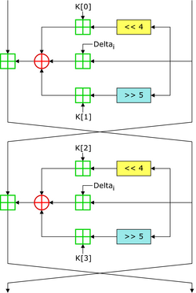

HackTheBox CyberApocalypse 2024 
=====

Once again we are back to HackTheBox Cyber Apocalypse this year with the theme Hacker Royale from 9 to 13 March. As usual there are a huge variety of challenges and I was thrilled to try and see how much I have improved from last year.
This year I managed to solve 6 crypto, 3 forensics and 2 hardware, which certainly exceeded my last year's result of only able to solve 3 crypto. I do hope I will be able to solve all 10 crypto for next year's Cyber Apocalypse and maybe start getting my hands dirty in rev and blockchain as well. 

---

## crypto/Dynastic
#### *source.py*
```python
from secret import FLAG
from random import randint

def to_identity_map(a):
    return ord(a) - 0x41

def from_identity_map(a):
    return chr(a % 26 + 0x41)

def encrypt(m):
    c = ''
    for i in range(len(m)):
        ch = m[i]
        if not ch.isalpha():
            ech = ch
        else:
            chi = to_identity_map(ch)
            ech = from_identity_map(chi + i)
        c += ech
    return c

with open('output.txt', 'w') as f:
    f.write('Make sure you wrap the decrypted text with the HTB flag format :-]\n')
    f.write(encrypt(FLAG))
```
#### output.txt
```txt
Make sure you wrap the decrypted text with the HTB flag format :-]
DJF_CTA_SWYH_NPDKK_MBZ_QPHTIGPMZY_KRZSQE?!_ZL_CN_PGLIMCU_YU_KJODME_RYGZXL
```

### Solution 
This is the Trithemius Cipher which shifts the alphabet up by it's index position in the plaintext string. We can easily rewrite the *encrypt* function into a decrpyt function by just shifting the alphabets down instead. 

```python
def to_identity_map(a):
    return ord(a) - 0x41

def from_identity_map(a):
    return chr(a % 26 + 0x41)

def decrypt(c):
    m = ''
    for i in range(len(c)):
        ch = c[i]
        if not ch.isalpha():
            dch = ch
        else:
            chi = to_identity_map(ch)
            dch = from_identity_map(chi - i)
        m += dch
    return m

enc = "DJF_CTA_SWYH_NPDKK_MBZ_QPHTIGPMZY_KRZSQE?!_ZL_CN_PGLIMCU_YU_KJODME_RYGZXL"
print(decrypt(enc))
```

### Flag
> HTB{DID_YOU_KNOW_ABOUT_THE_TRITHEMIUS_CIPHER?!_IT_IS_SIMILAR_TO_CAESAR_CIPHER}


## crypto/Makeshift
#### *source.py*
```python
from secret import FLAG

flag = FLAG[::-1]
new_flag = ''

for i in range(0, len(flag), 3):
    new_flag += flag[i+1]
    new_flag += flag[i+2]
    new_flag += flag[i]

print(new_flag)
```

#### *output.txt*
```txt
!?}De!e3d_5n_nipaOw_3eTR3bt4{_THB
```

### Solution 
The flag string is reversed and every 3 characters are shifted to the left. For example: 

$$ \text{flag[0], flag[1], flag[2] = H,T,B } $$

$$ \text{flag[0], flag[1], flag[2] = T,B,H } $$

This means that we can just easily write a python script to reverse all these functions and obtain the flag. 

```python
enc = "!?}De!e3d_5n_nipaOw_3eTR3bt4{_THB"
flag = ""
for i in range(0, len(enc), 3):
    flag += enc[i+2]
    flag += enc[i]
    flag += enc[i+1]
flag = flag[::-1]
print(flag)
```

### Flag
> HTB{4_b3tTeR_w3apOn_i5_n3edeD!?!}


## crypto/Primary Knowledge

#### *source.py*
```python
import math
from Crypto.Util.number import getPrime, bytes_to_long
from secret import FLAG

m = bytes_to_long(FLAG)

n = math.prod([getPrime(1024) for _ in range(2**0)])
e = 0x10001
c = pow(m, e, n)

with open('output.txt', 'w') as f:
    f.write(f'{n = }\n')
    f.write(f'{e = }\n')
    f.write(f'{c = }\n')
```

#### *output.txt*
```txt
n = 144595784022187052238125262458232959109987136704231245881870735843030914418780422519197073054193003090872912033596512666042758783502695953159051463566278382720140120749528617388336646147072604310690631290350467553484062369903150007357049541933018919332888376075574412714397536728967816658337874664379646535347
e = 65537
c = 15114190905253542247495696649766224943647565245575793033722173362381895081574269185793855569028304967185492350704248662115269163914175084627211079781200695659317523835901228170250632843476020488370822347715086086989906717932813405479321939826364601353394090531331666739056025477042690259429336665430591623215
```

### Solution
At first glance, this is just a very simple RSA, but the $n$ is generated as a *prime number*. We require $\phi(n)$ in order to find for $d$, meaning that we could just do $\phi(n) = n - 1$ and obtain $\phi(n)$ thus able to get $d$ as well. 

```python
from Crypto.Util.number import long_to_bytes, inverse

n = 144595784022187052238125262458232959109987136704231245881870735843030914418780422519197073054193003090872912033596512666042758783502695953159051463566278382720140120749528617388336646147072604310690631290350467553484062369903150007357049541933018919332888376075574412714397536728967816658337874664379646535347
e = 65537
c = 15114190905253542247495696649766224943647565245575793033722173362381895081574269185793855569028304967185492350704248662115269163914175084627211079781200695659317523835901228170250632843476020488370822347715086086989906717932813405479321939826364601353394090531331666739056025477042690259429336665430591623215

#n is prime so phi(n) is just n-1 

phi = n-1
d = inverse(e,phi)
print(long_to_bytes(pow(c,d,n)))
```

### Flag
> HTB{0h_d4mn_4ny7h1ng_r41s3d_t0_0_1s_1!!!}


## crypto/Iced TEA

#### *source.py*
```python
import os
from secret import FLAG
from Crypto.Util.Padding import pad
from Crypto.Util.number import bytes_to_long as b2l, long_to_bytes as l2b
from enum import Enum

class Mode(Enum):
    ECB = 0x01
    CBC = 0x02

class Cipher:
    def __init__(self, key, iv=None):
        self.BLOCK_SIZE = 64
        self.KEY = [b2l(key[i:i+self.BLOCK_SIZE//16]) for i in range(0, len(key), self.BLOCK_SIZE//16)]
        self.DELTA = 0x9e3779b9
        self.IV = iv
        if self.IV:
            self.mode = Mode.CBC
        else:
            self.mode = Mode.ECB
    
    def _xor(self, a, b):
        return b''.join(bytes([_a ^ _b]) for _a, _b in zip(a, b))

    def encrypt(self, msg):
        msg = pad(msg, self.BLOCK_SIZE//8)
        blocks = [msg[i:i+self.BLOCK_SIZE//8] for i in range(0, len(msg), self.BLOCK_SIZE//8)]
        
        ct = b''
        if self.mode == Mode.ECB:
            for pt in blocks:
                ct += self.encrypt_block(pt)
        elif self.mode == Mode.CBC:
            X = self.IV
            for pt in blocks:
                enc_block = self.encrypt_block(self._xor(X, pt))
                ct += enc_block
                X = enc_block
        return ct

    def encrypt_block(self, msg):
        m0 = b2l(msg[:4])
        m1 = b2l(msg[4:])
        K = self.KEY
        msk = (1 << (self.BLOCK_SIZE//2)) - 1

        s = 0
        for i in range(32):
            s += self.DELTA
            m0 += ((m1 << 4) + K[0]) ^ (m1 + s) ^ ((m1 >> 5) + K[1])
            m0 &= msk
            m1 += ((m0 << 4) + K[2]) ^ (m0 + s) ^ ((m0 >> 5) + K[3])
            m1 &= msk
        
        m = ((m0 << (self.BLOCK_SIZE//2)) + m1) & ((1 << self.BLOCK_SIZE) - 1) # m = m0 || m1

        return l2b(m)


if __name__ == '__main__':
    KEY = os.urandom(16)
    cipher = Cipher(KEY)
    ct = cipher.encrypt(FLAG)
    with open('output.txt', 'w') as f:
        f.write(f'Key : {KEY.hex()}\nCiphertext : {ct.hex()}')

```

#### *output.txt*
```txt
Key : 850c1413787c389e0b34437a6828a1b2
Ciphertext : b36c62d96d9daaa90634242e1e6c76556d020de35f7a3b248ed71351cc3f3da97d4d8fd0ebc5c06a655eb57f2b250dcb2b39c8b2000297f635ce4a44110ec66596c50624d6ab582b2fd92228a21ad9eece4729e589aba644393f57736a0b870308ff00d778214f238056b8cf5721a843
```

### Solution
This is basically the Tiny Encryption Algorithm (TEA) which is a very simplistic block cipher. We can just search for the decryption algorithm online and decrypt the ciphertext since the key is already given to us.

<p align="center">

</p>

```python
from binascii import unhexlify

class Mode:
    ECB = 1
    CBC = 2

def b2l(b):
    return int.from_bytes(b, byteorder='big')

def l2b(l):
    return l.to_bytes((l.bit_length() + 7) // 8, byteorder='big')

def pad(msg, block_size):
    padding_len = block_size - (len(msg) % block_size)
    padding = bytes([padding_len]) * padding_len
    return msg + padding

class Cipher:
    def __init__(self, key, iv=None):
        self.BLOCK_SIZE = 64
        self.KEY = [b2l(key[i:i+self.BLOCK_SIZE//16]) for i in range(0, len(key), self.BLOCK_SIZE//16)]
        self.DELTA = 0x9e3779b9
        self.IV = iv
        if self.IV:
            self.mode = Mode.CBC
        else:
            self.mode = Mode.ECB
    
    def _xor(self, a, b):
        return b''.join(bytes([_a ^ _b]) for _a, _b in zip(a, b))

    def encrypt(self, msg):
        msg = pad(msg, self.BLOCK_SIZE//8)
        blocks = [msg[i:i+self.BLOCK_SIZE//8] for i in range(0, len(msg), self.BLOCK_SIZE//8)]
        
        ct = b''
        if self.mode == Mode.ECB:
            for pt in blocks:
                ct += self.encrypt_block(pt)
        elif self.mode == Mode.CBC:
            X = self.IV
            for pt in blocks:
                enc_block = self.encrypt_block(self._xor(X, pt))
                ct += enc_block
                X = enc_block
        return ct

    def decrypt(self, ct):
        blocks = [ct[i:i+self.BLOCK_SIZE//8] for i in range(0, len(ct), self.BLOCK_SIZE//8)]
        
        msg = b''
        if self.mode == Mode.ECB:
            for block in blocks:
                msg += self.decrypt_block(block)
        elif self.mode == Mode.CBC:
            X = self.IV
            for block in blocks:
                dec_block = self.decrypt_block(block)
                msg += self._xor(X, dec_block)
                X = block

        # Remove padding
        msg = self._remove_padding(msg)
        return msg.decode('utf-8')

    def _remove_padding(self, msg):
        pad_len = msg[-1]
        return msg[:-pad_len]

    def encrypt_block(self, msg):
        m0 = b2l(msg[:4])
        m1 = b2l(msg[4:])
        K = self.KEY
        msk = (1 << (self.BLOCK_SIZE//2)) - 1

        s = 0
        for i in range(32):
            s += self.DELTA
            m0 += ((m1 << 4) + K[0]) ^ (m1 + s) ^ ((m1 >> 5) + K[1])
            m0 &= msk
            m1 += ((m0 << 4) + K[2]) ^ (m0 + s) ^ ((m0 >> 5) + K[3])
            m1 &= msk
        
        m = ((m0 << (self.BLOCK_SIZE//2)) + m1) & ((1 << self.BLOCK_SIZE) - 1)  # m = m0 || m1
        return l2b(m)

    def decrypt_block(self, ct_block):
        m = b2l(ct_block)
        m0 = m >> (self.BLOCK_SIZE // 2)
        m1 = m & ((1 << (self.BLOCK_SIZE // 2)) - 1)
        K = self.KEY
        msk = (1 << (self.BLOCK_SIZE // 2)) - 1

        s = self.DELTA * 32
        for i in range(32):
            m1 -= ((m0 << 4) + K[2]) ^ (m0 + s) ^ ((m0 >> 5) + K[3])
            m1 &= msk
            m0 -= ((m1 << 4) + K[0]) ^ (m1 + s) ^ ((m1 >> 5) + K[1])
            m0 &= msk
            s -= self.DELTA
        
        m = ((m0 << (self.BLOCK_SIZE // 2)) + m1) & ((1 << self.BLOCK_SIZE) - 1)  # m = m0 || m1
        return l2b(m)
    
key = unhexlify('850c1413787c389e0b34437a6828a1b2')
ct = unhexlify('b36c62d96d9daaa90634242e1e6c76556d020de35f7a3b248ed71351cc3f3da97d4d8fd0ebc5c06a655eb57f2b250dcb2b39c8b2000297f635ce4a44110ec66596c50624d6ab582b2fd92228a21ad9eece4729e589aba644393f57736a0b870308ff00d778214f238056b8cf5721a843')
cipher = Cipher(key)

print(cipher.decrypt(ct))
```

### Flag
> HTB{th1s_1s_th3_t1ny_3ncryp710n_4lg0r1thm_____y0u_m1ght_h4v3_4lr34dy_s7umbl3d_up0n_1t_1f_y0u_d0_r3v3rs1ng}


## crypto/Blunt

#### *source.py*
```python
from Crypto.Cipher import AES
from Crypto.Util.Padding import pad
from Crypto.Util.number import getPrime, long_to_bytes
from hashlib import sha256

from secret import FLAG

import random


p = getPrime(32)
print(f'p = 0x{p:x}')

g = random.randint(1, p-1)
print(f'g = 0x{g:x}')

a = random.randint(1, p-1)
b = random.randint(1, p-1)

A, B = pow(g, a, p), pow(g, b, p)

print(f'A = 0x{A:x}')
print(f'B = 0x{B:x}')

C = pow(A, b, p)
assert C == pow(B, a, p)

# now use it as shared secret
hash = sha256()
hash.update(long_to_bytes(C))

key = hash.digest()[:16]
iv = b'\xc1V2\xe7\xed\xc7@8\xf9\\\xef\x80\xd7\x80L*'
cipher = AES.new(key, AES.MODE_CBC, iv)

encrypted = cipher.encrypt(pad(FLAG, 16))
print(f'ciphertext = {encrypted}')
```

#### *output.txt*
```txt
p = 0xdd6cc28d 3714892429
g = 0x83e21c05 2212633605
A = 0xcfabb6dd 3484137181
B = 0xc4a21ba9 3298958249
ciphertext = b'\x94\x99\x01\xd1\xad\x95\xe0\x13\xb3\xacZj{\x97|z\x1a(&\xe8\x01\xe4Y\x08\xc4\xbeN\xcd\xb2*\xe6{'
```

### Solution
This is a simple textbook implementation of Diffie-Hellman key exchange algorithm. The algorithm works like this:

Let's say Alice and Bob wanted to exchange a secret key but they don't want Charlie to figure out the secret key despite knowing that Charlie can intercept the messages between them.
1. Alice and Bob agrees on a prime number modulus $p$ which defines the field of integers that they are working with, and also a generator value $g$ that's any value in the field. (Charlie knows the value of $p$ and $g$
2. Alice selects her own *private key* value $a$ and does $g^a$ to obtain $A$, Bob does the same as well.

$$ A \equiv g^a \mod p $$ 

$$ B \equiv g^b \mod p $$ 

3. Alice and Bob exchanges their $A$ and $B$ to each other and then raise its power to their own private key value. (Charlie knows the value of $A$ and $B$)
   
Alice:

$$ C \equiv B^a \mod p $$

Bob:

$$ C \equiv A^b \mod p $$

4. Charlie will not be able to figure out the secret key value $C$ because he only knows $A$, $B$, $p$ and $g$, which is not enough to calculate $C$. If any side had their private values leaked, only then will the key exchange be completely broken through.

$$ C \equiv B^a \equiv A^b \equiv g^ab \mod p $$

In this challenge, we are definitely the Charlie of this key exchange, and we need to somehow calculate the private key values and obtain the secret key value $C$, which will then be used to decrypt the ciphertext through simple AES decryption. Since the modulus $p$ is small, we can quite easily do a discrete log to obtain one of the private key values in relatively quick computational time, and then calculate the secret value $C$. 

$$ \log(g)A \equiv a \mod p$$

$$ \log(g)B \equiv b \mod p$$


```python
from sage.all import *
from Crypto.Cipher import AES
from Crypto.Util.number import long_to_bytes
from hashlib import sha256

ciphertext = b'\x94\x99\x01\xd1\xad\x95\xe0\x13\xb3\xacZj{\x97|z\x1a(&\xe8\x01\xe4Y\x08\xc4\xbeN\xcd\xb2*\xe6{'
p = 3714892429
F = GF(p)
g = F(2212633605)
A = F(3484137181)
B = F(3298958249)
a = discrete_log(A, base=g)
b = discrete_log(B, base=g)
C = pow(A,b)
assert C == pow(B,a)
#C = 1739735275

hash = sha256()
hash.update(long_to_bytes(int(C)))

key = hash.digest()[:16]
iv = b'\xc1V2\xe7\xed\xc7@8\xf9\\\xef\x80\xd7\x80L*'
cipher = AES.new(key, AES.MODE_CBC, iv)
flag = cipher.decrypt(ciphertext)
print(flag)
```

### Flag
> HTB{y0u_n3ed_a_b1gGeR_w3ap0n!!}


## crypto/Arranged

#### *main.sage*
```sage
from Crypto.Cipher import AES
from Crypto.Util.Padding import pad
from Crypto.Util.number import long_to_bytes
from hashlib import sha256

from secret import FLAG, p, b, priv_a, priv_b

F = GF(p)
E = EllipticCurve(F, [726, b])
G = E(926644437000604217447316655857202297402572559368538978912888106419470011487878351667380679323664062362524967242819810112524880301882054682462685841995367, 4856802955780604241403155772782614224057462426619061437325274365157616489963087648882578621484232159439344263863246191729458550632500259702851115715803253)

A = G * priv_a
B = G * priv_b

print(A)
print(B)

C = priv_a * B

assert C == priv_b * A

# now use it as shared secret
secret = C[0]

hash = sha256()
hash.update(long_to_bytes(secret))

key = hash.digest()[16:32]
iv = b'u\x8fo\x9aK\xc5\x17\xa7>[\x18\xa3\xc5\x11\x9en'
cipher = AES.new(key, AES.MODE_CBC, iv)

encrypted = cipher.encrypt(pad(FLAG, 16))
print(encrypted)
```

#### *output.txt*
```txt
(6174416269259286934151093673164493189253884617479643341333149124572806980379124586263533252636111274525178176274923169261099721987218035121599399265706997 : 2456156841357590320251214761807569562271603953403894230401577941817844043774935363309919542532110972731996540328492565967313383895865130190496346350907696 : 1)
(4226762176873291628054959228555764767094892520498623417484902164747532571129516149589498324130156426781285021938363575037142149243496535991590582169062734 : 425803237362195796450773819823046131597391930883675502922975433050925120921590881749610863732987162129269250945941632435026800264517318677407220354869865 : 1)
b'V\x1b\xc6&\x04Z\xb0c\xec\x1a\tn\xd9\xa6(\xc1\xe1\xc5I\xf5\x1c\xd3\xa7\xdd\xa0\x84j\x9bob\x9d"\xd8\xf7\x98?^\x9dA{\xde\x08\x8f\x84i\xbf\x1f\xab'
```

### Solution
This is an Elliptic Curve challenge but the value of modulus $p$ and $b$ is missing. The generator point $G$ and both points $A$ and $B$ are given, using these points we can substract the equations with each other to remove $b$ and then a *gcd* will let us obtain the value of $p$. 

Equation 1,2 and 3

$$ y_G^2 \equiv x_G^3 + 726x_G + b \mod p $$

$$ y_A^2 \equiv x_A^3 + 726x_A + b \mod p $$

$$ y_B^2 \equiv x_B^3 + 726x_B + b \mod p $$

Substracting Equation 1 to 2 and 2 to 3

$$ y_G^2 - y_A^2 \equiv x_G^3 - x_A^3 + 726(x_G - x_A) + b - b \mod p $$

$$ y_A^2 - y_B^2 \equiv x_A^3 - x_B^3 + 726(x_A - x_B) + b - b \mod p $$

Simplify and obtain p

$$ y_G^2 - y_A^2 - (x_G^3 - x_A^3) -726(x_G - x_A) \equiv  0 \mod p $$

$$ y_A^2 - y_B^2 - (x_A^3 - x_B^3) -726(x_A - x_B) \equiv  0 \mod p $$

$$
### Flag
> HTB{0rD3r_mUsT_b3_prEs3RveD_!!@!}

