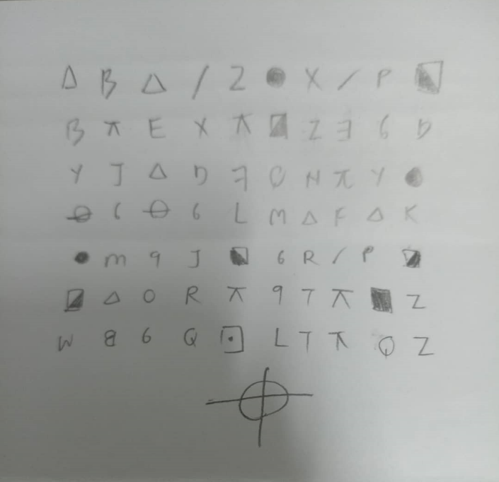
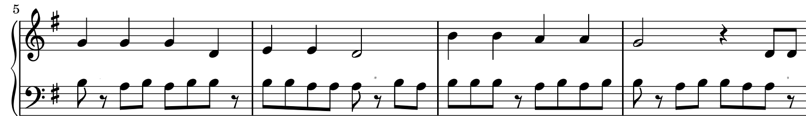
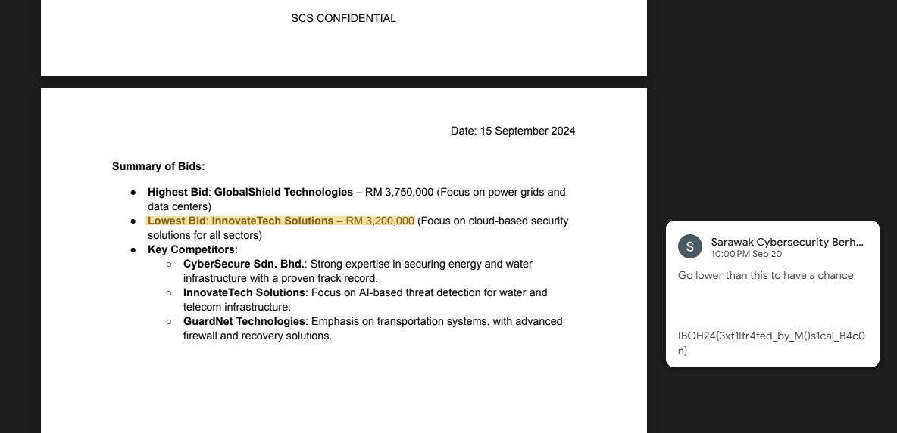

IBOH (Battle Of Hackers) CTF 2024 
=====

This event was hosted by the FSEC club and I had the opportunity to create and present 6 of my challenges to the players for this CTF. I have tried my best to make the challenges as interesting as possible but I think one unsurprising factor was that only 1 person solved 1 of my 6 challenges so I guess there just isn't much people interested in learning more about cryptography. 
I was actually a bit unsatisfied with how I made my challenges after the event. As I put myself in the player's perspective, I don't think I would have enjoyed much from my own challenge simply because there isn't really the "interesting" factor implemented in it except just using known theories. Nevertheless, I am writing this writeup to hopefully encourage more people to try pivoting themselves more into the category of cryptography. 
---

## Grüß Gott!

This challenge was made by my friend which was an interesting C++ code of the enigma machine

```cpp
#include <string>
#include <ctime>
#include <algorithm>
#include <iostream>
using namespace std;

// Function to randomize the order of elements in the array
void randomizeArray(int arr[], int size) {
    srand(time(0)); // Seed for random number generator
    random_shuffle(arr, arr + size); // Shuffle the array
}

string Ciao(string input, int n[6]){
    int code;
    int nsize=6;
    string output;
    for (int i = 0; i < input.size();i++)
    {
        if(input[i]==' '){output+=' ';continue;}
        code = input[i]-'a';
        for (int j = 0; j < nsize;j++)
        {
            code = (code + n[j]) % 26;
        }

        if(code%2==0)   code++;else code--;  // Reflector: if even, add 1; if odd, subtract 1.

        for (int j = nsize-1; j >=0;j--)
        {
            code = code - n[j];
            if(code<0)code=26+code;
        }

        n[0]++;
        for (int j = 0; j < nsize-1; j++)
        {
            if (n[j]>=26)
            {
                n[j + 1]++;
                n[j] = 0;
            }
        }
        n[nsize-1] = n[nsize-1] % 26;
        output += code+'a';
    }
    return output;
}

int main()
{
    string secret="justexample";
    string flag="IBOH24{"+secret +"}";
    // Define 6 rotors from german 
    // hint: 1 - 26 
    int n[6] = {1, 2, 3, 4, 5, 6 }; // just example  
    randomizeArray(n, 6);
    string cipher=Ciao(secret,n);
    cout <<"cipher:"<< cipher<< endl;
    cout << "flag:"<<flag<<endl;
    return 0;
}

//  cipher:sijrknpjtmjjfdmhhlb
```

### Solution
Well first of all, Enigma is actually quite simple to reverse so I just threw it to ChatGPT to generate the reverse script for me. Now the important part is actually on this two line
> int n[6] = {1, 2, 3, 4, 5, 6 }; // just example

and

> if(code%2==0)   code++;else code--;  // Reflector: if even, add 1; if odd, subtract 1.

Essentially, the encryption is based on the values of the rotors, which consist of 6 integers from 1 to 26. By going the brute-forcing way, it would mean about $26^6$ amount of tries needed, which can be a hassle. Looking closely at the code again, it can be realised that the rotors value are actually determined by odd and even integers, so technically we are just brute forcing $2^6$ which is way faster than before by a significant amount. (You can try to test some random rotors value to check, {1,0,0,0,0,0} and {17,0,0,0,0,0} and {9,0,0,0,0,0} are the same ciphertext)

```python
import itertools

def reverse_Ciao(ciphertext, n):
    nsize = len(n)
    output = ""

    for i in range(len(ciphertext)):
        if ciphertext[i] == ' ':
            output += ' '
            continue
        
        code = ord(ciphertext[i]) - ord('a')

        n[0] -= 1
        for j in range(nsize - 1):
            if n[j] < 0:
                n[j] = 25
                n[j + 1] -= 1
            else:
                break
        
        for j in range(nsize):
            code = (code + n[j]) % 26
        
        if code % 2 == 0:
            code -= 1
        else:
            code += 1
        
        for j in range(nsize - 1, -1, -1):
            code = (code - n[j]) % 26
            if code < 0:
                code = 26 + code
        
        output += chr(code + ord('a'))

    return output

ciphertext = "sijrknpjtmjjfdmhhlb"
possible_values = [0, 1]
all_rotor_combinations = itertools.product(possible_values, repeat=6)
for rotors in all_rotor_combinations:
    rotor = list(rotors)
    secret = reverse_Ciao(ciphertext, rotor)
    print("Decrypted secret:", secret, rotors)
```

On a side note, if you just kept the original "example" rotor values which is just {1, 2, 3, 4, 5, 6 }, and run the reverse script, you would already be able to see almost all the characters of the secret, and from there you can just roughly determine the first two character based on the spelling. I still wanted to find a perfect solution though hahaha. 

### Flag
> IBOH24{thisflaglookslikeenigma}

## I'll Kill Yall

This is the Zodiac Killer Cipher based on the Z408 cryptogram. The tricky part about this is that the image given to us is actually cropped out in the hex and we have to edit the height in hex to view the full image. 



Now we can just put this into the Zodiac Cipher decoder on dcode.fr to solve for this challenge.
> ILIKETOKILLPEOPLECANUFINDMEOUTHAHATHISISTHEFLAGKILLINGPEOPLEEZAFSTOPME

### Flag
> IBOH24{KILLINGPEOPLEEZAF}

## Old MacData Had a Spy, E-I-E-I-O


Based on the sheet music, we can see that a certain part of the bass side has some suspicious notes. Starting from the 3rd bar to the 9th bar, the bass side weirdly became quavers and only plays A and B only. This should obviously indicates that it's the Baconian Cipher. Taking a closer look, we can even see these small little characters on top of the eigth rests. 



Decoding the Baconian cipher and putting the characters in between the intended characters, we will get a shortened URL (bitly) which links us to the a drive file that has the flag in a comment. 
> BIT.LY/8XLM9CS



### Flag
> IBOH24{3xf1ltr4ted_by_M()s1cal_B4c0n}

## The Plan

#### server.py

```python
#!/usr/local/bin/python
import random
from Crypto.Util.number import long_to_bytes, bytes_to_long, getStrongPrime
from log import chatlog
import sys

def main():
    p = getStrongPrime(1024)
    q = getStrongPrime(1024)
    N = (p**2)*q

    while True:
        g = random.randint(2,p-1)
        
        if pow(g,p-1,p**2) != 1:
            break
    h = pow(g,N,N)

    def encrypt_log(N: int, g: int, h: int, log: bytes):
        val = bytes_to_long(log)
        #assert val < p #prevents log corruption
        enc_sessionkey = (val//p)+p+q
        r = random.randint(1,N-1)
        sol = (pow(g,val,N)*pow(h,r,N))%N                                                                       
        return hex(sol)[2:], enc_sessionkey

    def decrypt_log(g: int, p: int, enc_log: int):
        a = (pow(enc_log,p-1,p**2) - 1)//p
        b = (pow(g,p-1,p**2) - 1)//p
        res = (a*pow(b,-1,p))%p
        return hex(res)[2:]

    choice_encrypt = True
    choice_decrypt = True

    while True:
        try:
            print("\nSecret Encryption Service (Legacy)")
            print("(1) Encrypt")
            print("(2) Decrypt")
            print("(3) View Encrypted Log")
            print("(4) Update Encrypted Log")
            
            selection = input(">> ")
            if selection == '1':
                if choice_encrypt:
                    newlog = input("Enter log to be encrypted: ")
                    enc_log, enc_sessionkey = encrypt_log(N,g,h,newlog.encode())
                    print(f"Public keys: {(N,g)}")
                    print(f"Encrypted Log: {enc_log}")
                    print(f"Session Key: {enc_sessionkey}")
                    choice_encrypt = False
                else:
                    print("You already encrypted before")
                    
            elif selection == '2':
                if choice_decrypt:
                    encrypted_log = bytes_to_long(bytes.fromhex(input("Encrypted Log Value: ")))
                    dec_log = decrypt_log(g, p, encrypted_log)
                    print(f"Decrypted Log: {dec_log}")
                    choice_decrypt = False
                else:
                    print("You already decrypted before")
                    
            elif selection == '3':
                ENC_LOG, ENC_SESSIONKEY = encrypt_log(N,g,h,chatlog)
                print(f"Public keys: {(N,g)}")
                print(f"Encrypted Log: {ENC_LOG}")
                print(f"Session Key: {ENC_SESSIONKEY}")
                
            elif selection == '4':
                print("Something went wrong...")
                quit()
                
        except Exception as e:
            quit()
            
if __name__ == "__main__":
    sys.set_int_max_str_digits(10000)
    main()
else:
    raise Exception("Problem Occured")
```

If we look closely at the key generation, we can see that this is the implementation of the Okamoto-Uchiyama cryptosystem, with a slight twist in the program. We are only allowed to encrypt any input once, decrypt any input once and view the encrypted log. Another added twist was that the assert function to check for log corruption was commented, meaning we can technically corrupt the encryption process by giving an input larger than $p$, but we don't what is the use for this for now.  

The initial thought for this challenge was that it's as simple as just viewing the encrypted log, and throw it into the decrypt function, wouldn't we just get our flag back like that? And as expected, it returned bunch of weird bytes back, this instantly indicates that the log must have been larger than $p$. There's also this session key value that is given to us as well which is basically the key for us to fix the log corruption issue.

$$ plaintext = (sessionkey - p - q)*p + enc $$

This would mean that we need to somehow obtain the values of p and q in some other way, which can be exploited through the encrypt and decrypt functions. 

### Solution

The basic idea is that we will send an input #s# to the encrypt function that is larger than $N^{1/2}$ to get the encrypted input $enc$, since the program won't assert it meaning it's perfectly fine to do so. Using the fact that it's going to be corrupted, meaning if we were to send $enc$ to be decrypted, it will return us something other than $s$, which we will name it $sp$. Now, the plaintext that we should have received from the decrypt function should have been equal to our initial input, but since it isn't, we can just gcd the difference and obtain the value $p$.

$$ sp \equiv s \mod p $$

$$ sp - s \equiv 0 \mod p $$

$$ gcd(sp - s) = p $$

$$ q = N/p^2 $$

Now we can calculate for the multiplier with session key and just manually decrypt the log with the $p$ value we obtained.

```python
from pwn import *
from Crypto.Util.number import bytes_to_long, GCD, long_to_bytes
import sys
sys.set_int_max_str_digits(10000)
io = remote("127.0.0.1",5002)
print(io.recvuntil(b'>> ').decode())
io.sendline(b'1')
print(io.recvuntil(b': ').decode())
payload = b'aaaaaaaaaaaaaaaaaaaaaaaaaaaaaaaaaaaaaaaaaaaaaaaaaaaaaaaaaaaaaaaaaaaaaaaaaaaaaaaaaaaaaaaaaaaaaaaaaaaaaaaaaaaaaaaaaaaaaaaaaaaaaaaaaaaaaaaaaaaaaaaaaaaaaaaaaaaaaaaaaaaaaaaaaaaaaaaaaaaaaaaaaaaaaaaaaaaaaaaaaaaaaaaaaaaaaaaaaaaaaaaaa' #just need to be bigger than 192 bytes (1024*3/2)
io.sendline(payload)
io.recvuntil(b'Public keys: ')
pub = eval(io.recvline().strip(b'\n').decode())
print(pub)
io.recvuntil(b'Encrypted Log: ')
enc_payload = io.recvline().strip(b'\n').decode()
print(enc_payload)
io.recvuntil(b'Session Key: ')
enc_payload_session = io.recvline().strip(b'\n').decode()
print(enc_payload_session)

print(io.recvuntil(b'>> ').decode())
io.sendline(b'2')
io.recvuntil(b'Encrypted Log Value: ')
io.sendline(enc_payload.encode())
io.recvuntil(b'Decrypted Log: ')
dec_payload = bytes.fromhex(io.recvline().strip(b'\n').decode())
print(dec_payload)
s = bytes_to_long(payload)
sp = bytes_to_long(dec_payload)
p = GCD(s - sp, pub[0]) 
q = pub[0]//(p**2)

print(io.recvuntil(b'>> ').decode())
io.sendline(b'3')
io.recvuntil(b'Public keys: ')
io.recvline().strip(b'\n').decode()
io.recvuntil(b'Encrypted Log: ')
enc_flag = io.recvline().strip(b'\n').decode()
print(enc_flag)
io.recvuntil(b'Session Key: ')
enc_flag_session = io.recvline().strip(b'\n').decode()
print(enc_flag_session)

def decrypt_log(g: int, p: int, enc_log: int):
    a = (pow(enc_log,p-1,p**2) - 1)//p
    b = (pow(g,p-1,p**2) - 1)//p
    res = (a*pow(b,-1,p))%p
    return res

res = decrypt_log(pub[1], p, bytes_to_long(bytes.fromhex(enc_flag)))
k = int(enc_flag_session) - p - q
flag = long_to_bytes(res + k*p)
print(flag.decode())
```

The actual decrypted log we will see is 

```txt
[2024-08-14 10:35:21] User1: What's the plan?
[2024-08-14 10:36:02] User2: I don't know much, except that they're going to plant a bomb somewhere.
[2024-08-14 10:36:15] User1: Who else knows about the plan?
[2024-08-14 10:36:45] User2: Maybe User3 knows the most since he's closest to the leader.
[2024-08-14 10:36:58] User1: Should we ask him? We can't afford any mistakes.
[2024-08-14 10:37:10] User2: Yeah, we should. I think he’ll be online soon.
[2024-08-14 10:39:21] User3: How did you guys even forget about the plan? It's going to happen soon.
[2024-08-14 10:39:45] User3: The plan is to plant a bomb in the basement level 5's server room. It's meant to completely obliterate all information the organization has on us and delay their progress.
[2024-08-14 10:40:01] User1: Basement level 5... that's pretty secure. Are we sure we can pull this off?
[2024-08-14 10:40:15] User2: Oh yeah, that was the plan. How could I forget about it?
[2024-08-14 10:40:30] User2: User3, do we have everything we need for this? No loose ends, right?
[2024-08-14 10:40:50] User3: Everything's set. Just stick to the schedule and it'll go smoothly.
[2024-08-14 10:41:05] User3: Why are we still using this broken chat system to communicate? I couldn't even delete our convo before.
[2024-08-14 10:41:22] User1: If you can't even delete it, then no one can read it because all messages are encrypted properly, even the log files.
[2024-08-14 10:41:40] User2: What? The system is broken due to a malware injection recently, you know.
[2024-08-14 10:41:55] User3: It's alright, not like anyone is going to bother with this broken chat system.
[2024-08-14 10:42:10] User1: IBOH24{7h1s_1s_t0t4lly_OUt_of_R@NG3:_0k4m0tO_s4yS_C4lm1y_86eef5528c8557609ff5bf0859c9554c}
[2024-08-14 10:42:25] User1: See, I even typed out this system's password out in the open like this and I bet no one will even care about this.
[2024-08-14 10:42:56] User3: Let’s just make sure we’re not leaving any traces. We can’t afford any risks.
[2024-08-14 10:43:12] User3: I am going to corrupt the log file as well, now no one will be able to see our chat.
```

### Flag
> IBOH24{7h1s_1s_t0t4lly_OUt_of_R@NG3:_0k4m0tO_s4yS_C4lm1y_86eef5528c8557609ff5bf0859c9554c}


## The Detonation


## The Escape
