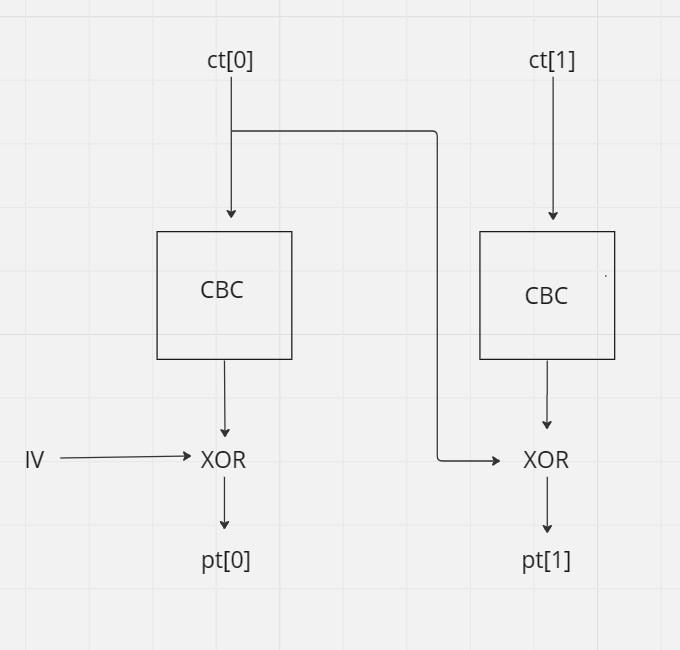
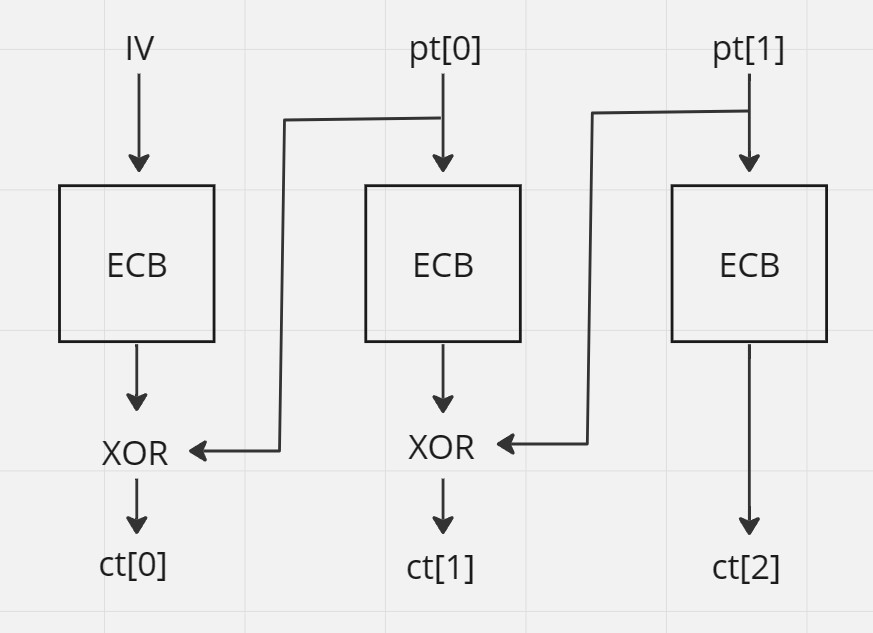

Wolv CTF 2024 
=====

This CTF event had a lot of focus on AES and hashing for the crypto category. I managed to solve 5/7 this time around eventhough I think I could have solved the remaining 2 if I was given more time to do a thorough analysis. 
---

## crypto/Limited1

#### *chall_time.py*
```python
import time
import random
import sys

if __name__ == '__main__':
    flag = input("Flag? > ").encode('utf-8')
    correct = [189, 24, 103, 164, 36, 233, 227, 172, 244, 213, 61, 62, 84, 124, 242, 100, 22, 94, 108, 230, 24, 190, 23, 228, 24]
    time_cycle = int(time.time()) % 256
    if len(flag) != len(correct):
        print('Nope :(')
        sys.exit(1)
    for i in range(len(flag)):
        random.seed(i+time_cycle)
        if correct[i] != flag[i] ^ random.getrandbits(8):
            print('Nope :(')
            sys.exit(1)
    print(flag)
```
### Solution
This challenge basically demonstrates a simple XOR operation but the key we need is the epoch value of the time that the script was ran modded by 256. This makes the challenge relatively easy to solve due to the fact that the time was $\mod256$
We can just write a python script that brute force through all 256 possible values and check if the first 5 characters matches with *wctf*

```python
import random

correct = [189, 24, 103, 164, 36, 233, 227, 172, 244, 213, 61, 62, 84, 124, 242, 100, 22, 94, 108, 230, 24, 190, 23, 228, 24]

for i in range(256):
    random.seed(i)
    if 119 == correct[0] ^ random.getrandbits(8):
        random.seed(i+1)
        if 99 == correct[1] ^ random.getrandbits(8):
            random.seed(i+2)
            if 116 == correct[2] ^ random.getrandbits(8):
                random.seed(i+3)
                if 102 == correct[3] ^ random.getrandbits(8):
                    time_cycle = i
                    
print(time_cycle)

flag = ""
for i in range(len(correct)):
    random.seed(i+time_cycle)
    flag += chr(correct[i] ^ random.getrandbits(8))
print(flag)
```

### Flag
> wctf{f34R_0f_m1ss1ng_0ut}

## crypto/Limited2

#### *NY_chall_time.py*
```python
import time
import random
import sys

if __name__ == '__main__':
    flag = input("Flag? > ").encode('utf-8')
    correct = [192, 123, 40, 205, 152, 229, 188, 64, 42, 166, 126, 125, 13, 187, 91]
    if len(flag) != len(correct):
        print('Nope :(')
        sys.exit(1)
    if time.gmtime().tm_year >= 2024 or time.gmtime().tm_year < 2023:
        print('Nope :(')
        sys.exit(1)
    if time.gmtime().tm_yday != 365 and time.gmtime().tm_yday != 366:
        print('Nope :(')
        sys.exit(1)    
    for i in range(len(flag)):
        # Totally not right now
        time_current = int(time.time())
        random.seed(i+time_current)
        if correct[i] != flag[i] ^ random.getrandbits(8):
            print('Nope :(')
            sys.exit(1)
        time.sleep(random.randint(1, 60))
    print(flag)

```

### Solution
This challenge is a modified version of the Limited1 challenge. Now in Limited2, we are given a range of possible epoch time value between December 31 2023 to the start of January 1 2024. And for every character xored, the script will pause for a random amount of time before repeating the xor operation for the next character. The solution to this challenge is stil relatively similiar to how we solved Limited1, which is to just brute force all possible epoch time values and try to match the first few characters to the flag format *wctf*

```python
import random

correct = [192, 123, 40, 205, 152, 229, 188, 64, 42, 166, 126, 125, 13, 187, 91]

possible = []
for i in range(1703894400, 1704153600):
    random.seed(i)
    if "w" == chr(correct[0] ^ random.getrandbits(8)):
        i2 = i+random.randint(1,60)
        random.seed(i2+1)
        if "c" == chr(correct[1] ^ random.getrandbits(8)):
            i3 = i2+random.randint(1,60)
            random.seed(i3+2)
            if "t" == chr(correct[2] ^ random.getrandbits(8)):
                i4 = i3+random.randint(1,60)
                random.seed(i4+3)
                if "f" == chr(correct[3] ^ random.getrandbits(8)):
                        possible.append(i)
                        
flag = ""
for time_cycle in possible:
    flag = ""
    for i in range(len(correct)):
        random.seed(i+time_cycle)
        res = correct[i] ^ random.getrandbits(8)
        flag += chr(res)
        time_cycle += random.randint(1,60)
        
print(flag)
```

### Flag
> wctf{b4ll_dr0p}

## crypto/Blocked1

#### *server.py*
```python

"""
----------------------------------------------------------------------------
NOTE: any websites linked in this challenge are linked **purely for fun**
They do not contain real flags for WolvCTF.
----------------------------------------------------------------------------
"""

import random
import secrets
import sys
import time

from Crypto.Cipher import AES


MASTER_KEY = secrets.token_bytes(16)


def generate(username):
    iv = secrets.token_bytes(16)
    msg = f'password reset: {username}'.encode()
    if len(msg) % 16 != 0:
        msg += b'\0' * (16 - len(msg) % 16)
    cipher = AES.new(MASTER_KEY, AES.MODE_CBC, iv=iv)
    return iv + cipher.encrypt(msg)


def verify(token):
    iv = token[0:16]
    msg = token[16:]
    cipher = AES.new(MASTER_KEY, AES.MODE_CBC, iv=iv)
    pt = cipher.decrypt(msg)
    username = pt[16:].decode(errors='ignore')
    return username.rstrip('\x00')


def main():
    username = f'guest_{random.randint(100000, 999999)}'
    print("""                 __      __
 _      ______  / /___  / /_ _   __
| | /| / / __ \\/ / __ \\/ __ \\ | / /
| |/ |/ / /_/ / / /_/ / / / / |/ /
|__/|__/\\____/_/ .___/_/ /_/|___/
              /_/""")
    print("[      password reset portal      ]")
    print("you are logged in as:", username)
    print("")
    while True:
        print(" to enter a password reset token, please press 1")
        print(" if you forgot your password, please press 2")
        print(" to speak to our agents, please press 3")
        s = input(" > ")
        if s == '1':
            token = input(" token > ")
            if verify(bytes.fromhex(token)) == 'doubledelete':
                print(open('flag.txt').read())
                sys.exit(0)
            else:
                print(f'hello, {username}')
        elif s == '2':
            print(generate(username).hex())
        elif s == '3':
            print('please hold...')
            time.sleep(2)
            # thanks chatgpt
            print("Thank you for reaching out to WOLPHV customer support. We appreciate your call. Currently, all our agents are assisting other customers. We apologize for any inconvenience this may cause. Your satisfaction is important to us, and we want to ensure that you receive the attention you deserve. Please leave your name, contact number, and a brief message, and one of our representatives will get back to you as soon as possible. Alternatively, you may also visit our website at https://wolphv.chal.wolvsec.org/ for self-service options. Thank you for your understanding, and we look forward to assisting you shortly.")
            print("<beep>")


main()
```

### Solution
Looking at this server script, we can see that it's an implementation of AES CBC and it requires us to somehow manipulate the ciphertext so that when the server decrypts it will be able to detect the username *doubledelete*. We can get our own password reset token with the second selection and we could know how the plaintext of this token would look like as well. This means we can obtain the byte values (let's call it $h$) 

$$ h= pt[1] \otimes ct[0]$$

Since the first part of the plaintext and ciphertext is not important in the conditions to obtain the flag at all, we can choose to manipulate ct[0] in a way that makes $pt[1] = doubledelete\0\0\0\0$ when decrypted. 

$$ newct[0] = doubledelete\0\0\0\0 \otimes h $$

<p align="center">

</p>

Now we can just send the new token (iv + ct[0] + newct[1]) back to the server and it should be able to decrypt and receive the username "doubledelete".


```python
from pwn import *
from binascii import hexlify, unhexlify
r = remote("blocked1.wolvctf.io", 1337)

print(r.recvuntil(b"you are logged in as: ").decode())
username = r.recvline().decode()[:-1]
assert len(username) == 12
print(r.recvuntil(b"> ").decode())
r.sendline(b"2")
token = r.recvline().decode()
print(token)
print(r.recvuntil(b"> ").decode())
iv = token[:32]
ct1 = token[32:64]
ct2 = token[64:96]
f = xor(unhexlify(ct1), str(username).encode() + b'\0\0\0\0')
ct1 = hexlify(xor(f, b'doubledelete\0\0\0\0')).decode()
newtoken = iv + ct1 + ct2
print(newtoken)
r.sendline(b'1')
print(r.recvuntil(b"> ").decode())
r.sendline(newtoken.encode())
print(r.recvline().decode())
```

### Flag
> wctf{th3y_l0st_th3_f1rst_16_byt35_0f_th3_m3ss4g3_t00}

## crypto/Blocked2

#### *server.py*
```python
import random
import secrets
import sys
import time

from Crypto.Cipher import AES
from Crypto.Util.Padding import pad
from Crypto.Util.strxor import strxor


MASTER_KEY = secrets.token_bytes(16)


def encrypt(message):
    if len(message) % 16 != 0:
        print("message must be a multiple of 16 bytes long! don't forget to use the WOLPHV propietary padding scheme")
        return None

    iv = secrets.token_bytes(16)
    cipher = AES.new(MASTER_KEY, AES.MODE_ECB)
    blocks = [message[i:i+16] for i in range(0, len(message), 16)]
    print(blocks)
    # encrypt all the blocks
    encrypted = [cipher.encrypt(b) for b in [iv, *blocks]]
    print(encrypted)
    # xor with the next block of plaintext
    for i in range(len(encrypted) - 1):
        encrypted[i] = strxor(encrypted[i], blocks[i])
    print(encrypted)
    return iv + b''.join(encrypted)


def main():
    message = open('message.txt', 'rb').read()
    print("""                 __      __
 _      ______  / /___  / /_ _   __
| | /| / / __ \\/ / __ \\/ __ \\ | / /
| |/ |/ / /_/ / / /_/ / / / / |/ /
|__/|__/\\____/_/ .___/_/ /_/|___/
              /_/""")
    print("[          email portal          ]")
    print("you are logged in as doubledelete@wolp.hv")
    print("")
    print("you have one new encrypted message:")
    print(encrypt(message).hex())

    while True:
        print(" enter a message to send to dree@wolp.hv, in hex")
        s = input(" > ")
        message = bytes.fromhex(s)
        print(encrypt(message).hex())


main()
```

### Solution
This is a modified version of the Blocked 1 challenge, this time a custom AES ECB encryption is implemented and I have roughly sketched it out in the diagram below. 

<p align="center">

</p>

The vulnerability of this challenge is that the iv is given together with the ciphertext just like the Blocked 1 challenge which is how we will be able to decrypt the rest of the plaintext blocks. Looking at the encryption scheme, we can see that the last block of ciphertext is always just a direct AES ECB encryption from the last block of plaintext. This means that we can get the ECB encryption fo whatever block of plaintext then xor with the known ciphertext to recover the next block of plaintext. And luckily, the IV given to us will be the first to start this loop of decryption. 

1. Send IV to get E(IV)
2. $pt[0] = E(iv) \otimes ct[0]$
3. Repeat the process but shift to the next block (send pt[0] and xor with ct[1] to get pt[1])

```python
from pwn import *
from binascii import unhexlify,hexlify

r = remote('blocked2.wolvctf.io', 1337)
r.recvuntil(b"you have one new encrypted message:\n").decode()
encflag = r.recvline().decode()[:-1]


msg = []

r.recvuntil(b" > ")
r.sendline(encflag[:32].encode())
res = r.recvline().decode()[:-1]
Eiv = unhexlify(res[64:96])
msg.append(xor(Eiv,unhexlify(encflag[32:64])))
print(msg)

for i in range(16):
    r.recvuntil(b" > ")
    r.sendline(hexlify(msg[i]))
    res = r.recvline().decode()[:-1]
    Ept = unhexlify(res[64:96])
    msg.append(xor(Ept,unhexlify(encflag[32*(i+2): 32*(i+3)])))

print("".join([i.decode() for i in msg]))
```

### Flag
> wctf{s0m3_g00d_s3cur1ty_y0u_h4v3_r0lling_y0ur_0wn_crypt0_huh}

## crypto/TagSeries1

#### *chal.py*
```python
import sys
import os
from Crypto.Cipher import AES

MESSAGE = b"GET FILE: flag.txt"
QUERIES = []
BLOCK_SIZE = 16
KEY = os.urandom(BLOCK_SIZE)


def oracle(message: bytes) -> bytes:
    aes_ecb = AES.new(KEY, AES.MODE_ECB)
    return aes_ecb.encrypt(message)[-BLOCK_SIZE:]


def main():
    for _ in range(3):
        command = sys.stdin.buffer.readline().strip()
        tag = sys.stdin.buffer.readline().strip()
        if command in QUERIES:
            print(b"Already queried")
            continue

        if len(command) % BLOCK_SIZE != 0:
            print(b"Invalid length")
            continue

        result = oracle(command)
        if command.startswith(MESSAGE) and result == tag and command not in QUERIES:
            with open("flag.txt", "rb") as f:
                sys.stdout.buffer.write(f.read())
                sys.stdout.flush()
        else:
            QUERIES.append(command)
            assert len(result) == BLOCK_SIZE
            sys.stdout.buffer.write(result + b"\n")
            sys.stdout.flush()


if __name__ == "__main__":
    main()
```

### Solution
The server requires us to send a command and a tag where the command starts with the set message and the tag must match with the return from the oracle function. The oracle function will take in the string from the command input and encrypts it with AES ECB but only returns the last block of ciphertext. Basically, we could send a set string with one block of length to the command just to receive back the ciphertext of the set string block. Then we can just send to the server the set message and make sure the last block is the same as the set string we sent previously so that the when we send the ciphertext as the tag, we will get a match and thus obtain the flag. 

```python
from pwn import *

MESSAGE = b"GET FILE: flag.txt"
r = remote("tagseries1.wolvctf.io", 1337)
r.recvline()
r.sendline(b"aaaaaaaaaaaaaaaa")
r.sendline(b"aaaaaaaaaaaaaaaa")
res = r.recvline()[:-1]
print(res)
msg = MESSAGE + b"a"*14 + b"a"*16
r.sendline(msg)
r.sendline(res)
flag = r.recvline().decode()
print(flag)
```

### Flag
> wctf{C0nGr4ts_0n_g3tt1ng_p4st_A3S}
