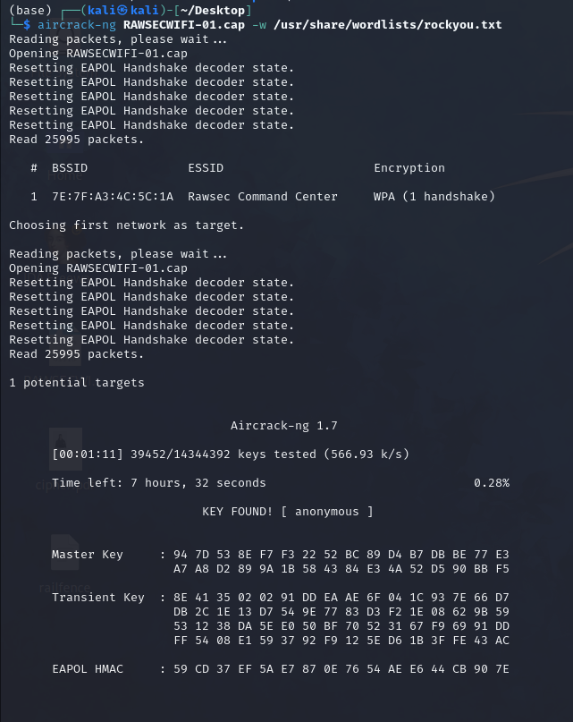
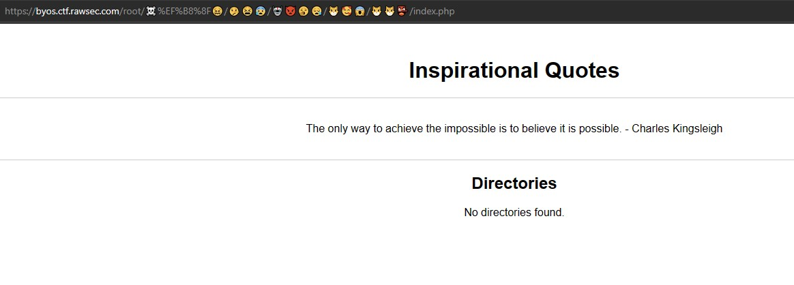
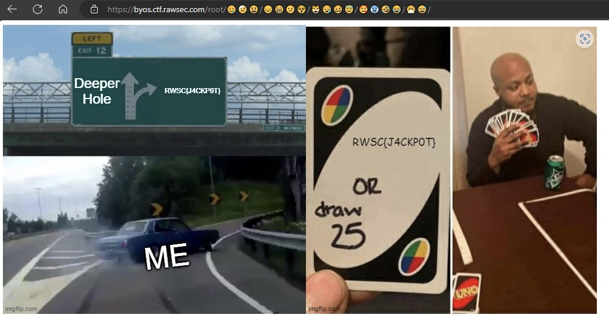

rENTAS CTF 2024 
=====

This CTF was really interesting with very unique challenges and I was only able to solve 4 crypto challenges. 

---

## crypto/round and round


#### *ct_2.txt*
```txt
2126226{19122929121712_6121911821_26422_842928}
```

### Solution
We can figure out that this is pizzini cipher right away from the challenge description.
Just use this [decoder](https://www.cachesleuth.com/pizzini.html) to solve the cipher 

### Flag
> RWSC{PIZZINI_CIPHER_WAS_EAZY}

## network/Last hope 

### Solution
We are given a .cap file and the challenge description mentions about cracking the wifi password. So I instantly went to use **aircrack** to do a simple dictionary attack on it.
> aircrack -ng RAWSECWIFI-01.cap -w {your_wordlist}
Ended up finding the password to be **anonymous**


### Flag
> RSWC{anonymous}
## Steganography/Zombiefy

#### *kowai* [file](kowai)

### Solution
The file given is in base 32 so I threw it into cyberchef and ended up getting a .jpg image file out of it


Looking at the hex and ASCII values of the image, we can see a interesting string **"JDVRiF"** which instantly brought me to this [tool](https://github.com/CleasbyCode/jdvrif).
After extracting data using the jdvrif tool, we are able to obtain an mp3 file. From then on it's a guessing game on which audio steganography tool was used to encode the flag. In the end it was hinted that this particular [tool](https://github.com/danielcardeenas/AudioStego) was used for the audio steganography part. Finally after extracting the flag out of the audio file with this tool, we managed to obtain the hex values **52 57 53 43 7B 6B 75 72 30 6E 33 6B 4F 7D** which translates to the flag **RWSC{kur0n3kO}**

### Flag
> RWSC{kur0n3kO}

## web/Bring your own script

This challenge consist of a webpage that lists out a bunch of subdirectories that are named with emojis. 


Once I entered into 5 subdirectories, the webpages stops displaying a list of emoji subdirectories and instead a **No directories found**, indicating the end of the subdirectory. 


### Solution
To tackle this challenge, we need to write a script that properly traverse through each and every possible subdirectory combinations by brute forcing and there will definitely be one webpage that doesn't display the **No directories found**. The script first of all uses **requests** to send a GET request and filter out all the emojis by placing them into a list. This step is repeated everytime we enter into a new subdirectory until we reach the fifth subdirectory, then we change into checking whether the page displays the word **No directories found**. 

```python
import requests

def searchAllEmoji(url):
    res = requests.get(url)
    text = list(res.text)
    curr_emoji = []
    emoji = ""
    i = 0
    while i != len(text):
        if ord(text[i]) > 128: 
            while ord(text[i]) > 128:
                emoji += text[i]
                i += 1
            curr_emoji.append(emoji)
            emoji = ""
        i += 1
    return curr_emoji

base_directory = 'https://byos.ctf.rawsec.com/root/'
a = searchAllEmoji(base_directory)
for i in a:
    new_directory = base_directory + i + '/'
    print(new_directory)
    b = searchAllEmoji(new_directory)
    for j in b:
        new_directory2 = new_directory + j + '/'
        print(new_directory2)
        c = searchAllEmoji(new_directory2)
        for k in c:
            new_directory3 = new_directory2 + k + '/'
            print(new_directory3)
            d = searchAllEmoji(new_directory3)
            for l in d:
                new_directory4 = new_directory3 + l + '/'
                print(new_directory4)
                e = searchAllEmoji(new_directory4)
                for m in e:
                    new_directory5 = new_directory4+ m + '/'
                    print(new_directory5)
                    response = requests.get(new_directory5).text
                    if "No directories found" not in bruh:
                        print(response)
                        exit()
                        
```

The webpage that breaks the loop is https://byos.ctf.rawsec.com/root/🤤🤕😃/😔😁😕😵/😺😪🥴😇/🥰🥶🤣😂/🤧😅/
We can see the flag once we enter the correct web page. 


### Flag
> RWSC{J4CKP0T}


